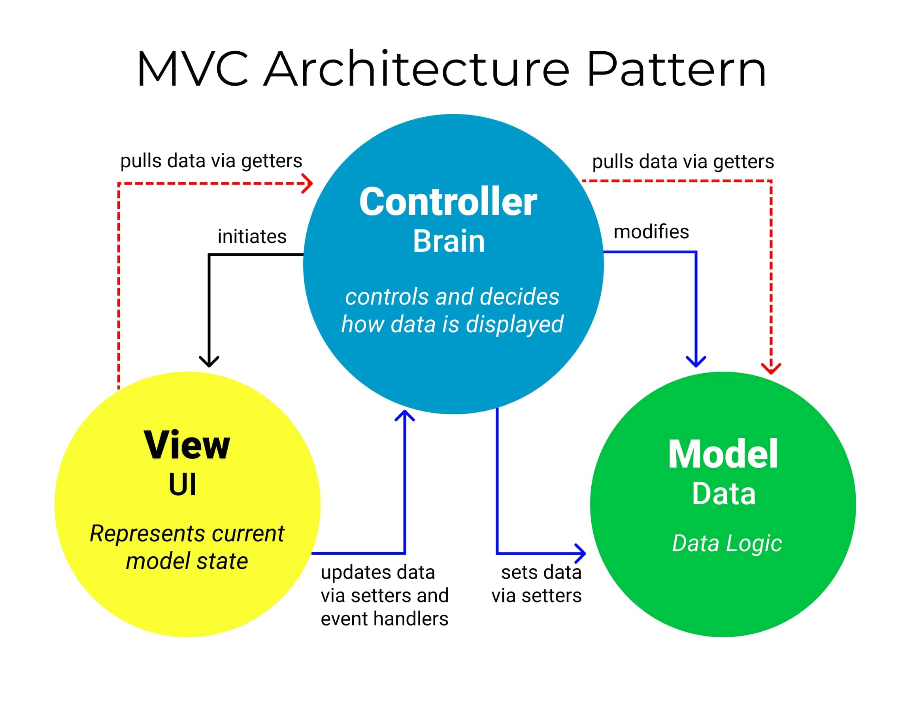

# Node & ExpressJS

```js
    const path = require('path');
    const morgan = require('morgan');
    const { engine } = require('express-handlebars');
    const express = require('express');

    const app = express();
    const port = 3000;

    // Static files
    app.use(express.static(path.join(__dirname, 'public')));

    // HTTP logger
    app.use(morgan('combined'));

    // Template engine (handlebars)
    app.engine('hbs', engine({
        extname: ".hbs"
    }));
    app.set('view engine', 'hbs');
    app.set('views', path.join(__dirname, 'resources/views'))

    // Route
    app.get('/', (req, res) => {
        res.render('home')
    })

    app.get('/news', (req, res) => {
        res.render('news')
    })

    app.listen(port, () => {
        console.log(`Example app listening on port ${port}`)
    })
```
- Template engine (Express - handlebars): có thể viết ra những file chứa mã ở nơi khác - gọn gàng hơn - chia layout
- SCSS: tiền xử lý CSS khi run thì sẽ compine ra app.css và app.css này được link vào html

## UseBootstrap
- Sử dụng bootstrap: thư viện có sẵn các component: navbar, ....

## Basic routing
- Routing refers to determining how an application responds to a client request to a particular endpoint, which is a URI (or path) and a specific HTTP request method (GET, POST, and so on).
- Each route can have one or more handler functions, which are executed when the route is matched.
- Route definition takes the following structure: `app.METHOD(PATH, HANDLER)`

    ```js
        app.get('/', (req, res) => {
            res.render('home')
        })
    ```
- Bất cứ domain nào tồn tại duy nhất thì có thể gọi là URI

## GET Method
- Muốn nhận dữ liệu từ server về client thì dùng `get` method

## Query parameters
- Có thể truyền được dữ liệu qua chính url
    ```js
        `http://localhost:3000/search?q=test&ref=abc&author=gin`

        app.get('/search', (req, res) => {
            console.log(req.query)
            res.render('search')
        })

        => { q: 'test', ref: 'abc', author: 'gin' }
    ```

## Form default behavior
- Khi bấm btn submit thì sẽ lấy value của các thẻ input có name và đính lên url dưới dạng parameters

## POST Method
- Gửi dữ liệu từ client lên server
- Gửi form với method:
    + post: data gửi dưới dạng formData
    + get: data gửi dưới dạng parameters và được gán trên url

## Prettier - Code formatter
- Format laị cho ngay thẳng: search 3 thư viện trên github rồi đọc document làm theo
    - prettier: thêm vào package.json
        ```json
        "format": "prettier --write --tab-width 4 --single-quote --trailing-comma all \"src/**/*.{js,json,scss,jsx}\"",
        ```

    - lint-staged: chạy một dòng lệnh trên file được add vào git, add vào package.json (cấp 1)
        ```json
        "lint-staged": {
            "src/**/*.{js,json,scss,jsx}": "prettier --write --tab-width 4 --single-quote --trailing-comma all"
        },   

        // sau khi thêm lệnh này vào thì đổi format ở trên thành
        "format" : "lint-staged",
        ```

    - husky: truớc khi commit or push code lên git thì chạy lệnh 
        ```json
        npx husky init
        // vào file pre-commit ở husky thêm vào lệnh `npx lint-staged`
        // Lúc này có sẽ tự động chạy lệnh format trước khi commit code cho nên có thế xóa "format" : "lint-staged" ở trên
        ```
    - Sau khi hoàn thành thì trước khi ta commit code lên git thì code sẽ được format
    ```json
    "lint-staged": {
        "src/**/*.{js,json,scss,jsx}": "prettier --single-quote --trailing-comma all --tab-width 4 --print-width 80 --bracket-spacing true --write"
    },
    ```
```
npm i prettier lint-staged husky --save-dev
```

## Mô hình MVC
- ***Model***, ***View***, ***Controller***

    

## [MVC] Routes & Controllers
- Routes: định nghĩa tuyến cho trang web `Ex: userRoute, productRoute, ...`
- Controller: thực thi các logic, nên chia theo đối tượng, chức năng. `Ex: userController, productController, ...`

## [MVC] Model
- Install mongoose: 
    ```sh
    npm install mongoose
    ```
- Connect to DB:
    ```js
    const mongoose = require('mongoose');

    async function connect() {
        try {
            await mongoose.connect('mongodb://localhost:27017/sunshine_education_dev')
            console.log('Database connected!')
        } catch (error) {
            console.log('Database failed!', error)
        }
    }

    module.exports = { connect }
    ```
- Create model: 
    ```js
    const mongoose = require('mongoose')
    const Schema = mongoose.Schema

    const Course = new Schema({
        name: { type: String, maxLength: 255},
        description: { type: String, maxLength: 1000},
        image: { type: String, maxLength: 255},
        createAt: { type: Date, default: Date.now},
        updateAt: { type: Date, default: Date.now},
    })

    module.exports = mongoose.model('Course', Course);
    ```

## [CRUD] Read from DB
    ```js
    const Course = require('../models/Course')

    await Course.find({})
    ```

## Course detail page
- Khi click vào `name` or `img` thì có thẻ `a` link đến `/courses/:slug`, từ controller ta có thể gọi đến slug này 
- Từ controller gọi tới model lấy course từ database `Model.findOne(slug)`
` Truyền course sang trang show.hbs bằng:
    ```js
        res.render('courses/show', {
            course: mongooseToObject(await Course.findOne({slug: req.params.slug}))
        });
    ```

## [CRUD] Create new course
- Tạo page crete là một from, method là `post`, action đến `/courses/store`, tại store sẽ lấy req.body và tạo một `Course` mới add vào db

## [CRUD] Update course
- Tạo page manage course hiển thị danh sách các courses, khi ấn vào course sẽ chuyển hướng đến `manage/:id/edit` trang này cũng sẽ là một form tương tự như create nhưng value được điền sẵn, sau đó ta chỉnh sửa gì đó và ấn vào submit thì sẽ tìm ở db `findByIdAndUpdate()`

## [CRUD] Delete course
- Lấy Id của course từ btn delete rồi truyền vào action form rồi call api delete, use `findByIdAndDelete`

## Soft delete
- Dùng thư viện `mongoose-delete`
- Delete (soft): thêm trường `delete: true` vào data, dùng `Model.delete()`
- Restore: sửa data thành `delete: false`, dùng `Model.restore()`
- Force delete: xóa khỏi DB, dùng `Model.findByIdAndDelete()`
- Dùng `find()` để lấy danh sách courses chưa bị xóa (soft) và dùng `Course.findWithDeleted({deleted: true})` để lấy danh sách courses đã bị xóa

## Select all with checkbox
- tạo check box trước mỗi khóa học, select all thì chọn tất cả checkbox